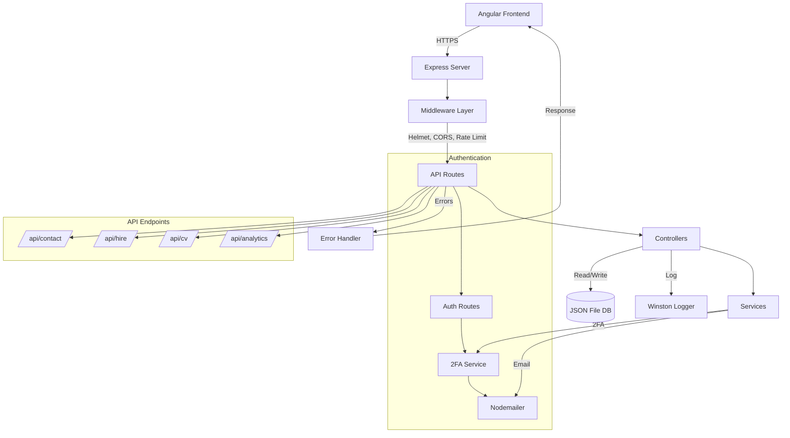
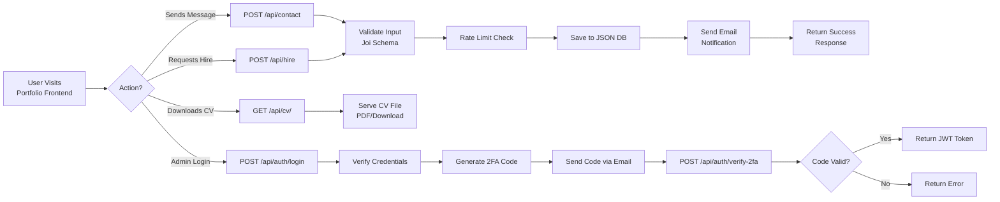
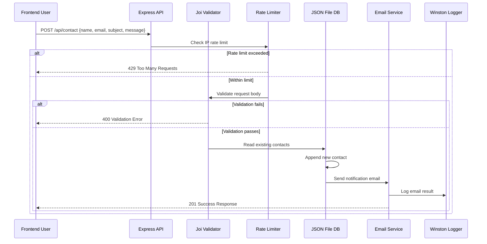
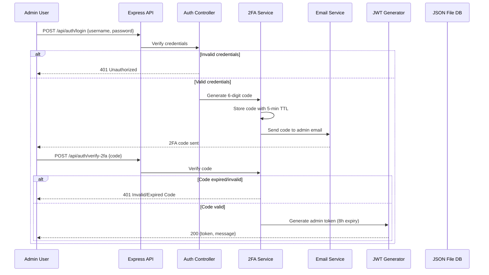
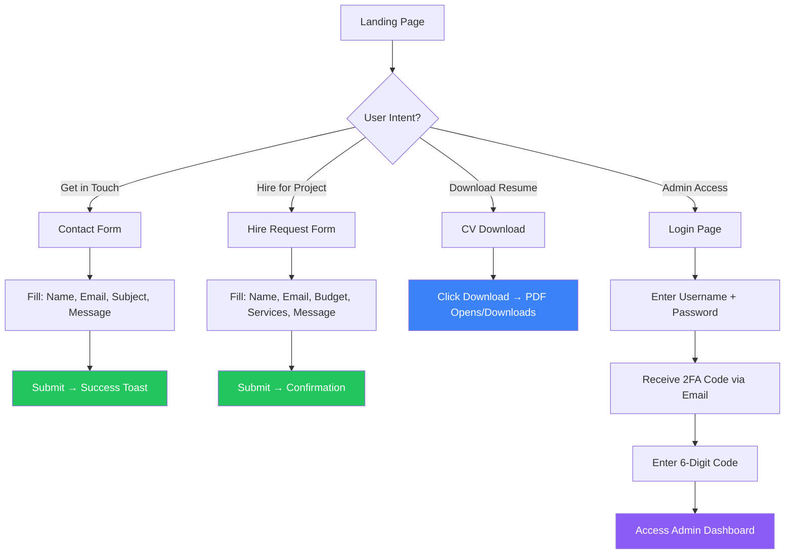

# Portfolio Backend API

[](https://nodejs.org/)
[](https://expressjs.com/)
[](LICENSE)
[]()

> A secure, production-ready REST API backend for a personal portfolio application. Built with Express.js, featuring contact management, hire requests, CV downloads, analytics, and 2FA-protected admin authentication.

---

## 📌 Table of Contents

- [Project Overview](#-project-overview)
- [What's New](#-whats-new)
- [Architecture](#%EF%B8%8F-project-architecture)
- [Folder Structure](#-folder-structure)
- [Application Flow](#-application-flow)
- [Data Flow](#-data-flow--process-visualization)
- [UI/UX Flow](#%EF%B8%8F-uiux-flow)
- [Installation & Setup](#%EF%B8%8F-installation--setup)
- [Usage](#-usage)
- [Future Improvements](#-future-improvements)
- [Contribution Guide](#-contribution-guide)
- [License](#-license)

---

## 📌 Project Overview

**Portfolio Backend** is a lightweight, secure REST API service designed to power a personal portfolio website. It provides endpoints for:

- **Contact Form Submissions** — Receive and manage messages from visitors
- **Hire Requests** — Capture project inquiries with budget and service details
- **CV/Resume Downloads** — Serve resume documents in multiple formats
- **Analytics Dashboard** — Track engagement metrics and submission statistics
- **Admin Authentication** — JWT-based login with **Two-Factor Authentication (2FA)**

### Key Goals

| Goal | Description |
|------|-------------|
| **Security First** | Helmet, rate limiting, 2FA, JWT tokens, input validation via Joi |
| **Lightweight** | File-based JSON database — no external DB dependency |
| **Developer Friendly** | Clean MVC architecture, structured logging, error handling |
| **Production Ready** | Graceful shutdown, unhandled rejection handling, CORS configured |

---

## 🚀 What's New

### Latest Update — v1.0.0

| Type | Description |
|------|-------------|
| ✨ **Feature** | 2FA email verification for admin login flow |
| ✨ **Feature** | Analytics endpoint for contact/hire submission metrics |
| ✨ **Feature** | CV download endpoints (file, info, base64) |
| 🔒 **Security** | Rate limiting with skip logic for authenticated admin requests |
| 🛡️ **Security** | Input validation middleware using Joi schemas |
| 🔧 **Fix** | Graceful handling of unhandled promise rejections |
| 🔧 **Fix** | CORS credentials enabled for Angular frontend integration |
| 📝 **Refactor** | Centralized error handling with structured middleware |
| 📝 **Refactor** | File-based JSON database abstraction layer |

---

## 🏗️ Project Architecture

The backend follows a **layered MVC-inspired architecture** with clear separation of concerns:



### Architecture Layers

| Layer | Responsibility | Key Files |
|-------|---------------|-----------|
| **Server** | Bootstrapping, process management | `server.js` |
| **App** | Middleware, routing, error handling | `src/app.js` |
| **Routes** | URL mapping, rate limiting per route | `src/routes/*.js` |
| **Controllers** | Request handling, response formatting | `src/controllers/*.js` |
| **Services** | Business logic (email, 2FA) | `src/services/*.js` |
| **Database** | File-based JSON storage | `database/db.json`, `src/utils/db.js` |
| **Utils** | Logging, DB helpers, config | `src/utils/*`, `src/config/*` |

---

## 📂 Folder Structure

```
portfolio-backend/
├── database/
│   ├── db.json                 # Main data store (contacts, hires)
│   ├── logs_db.json            # Analytics/logs data store
│   ├── migrations/             # Database migration scripts
│   └── seeds/                  # Seed data for development
├── logs/                       # Application log files (Winston)
├── src/
│   ├── app.js                  # Express app configuration
│   ├── config/
│   │   └── index.js            # Centralized environment config
│   ├── controllers/            # Request handlers
│   │   ├── analytics.controller.js
│   │   ├── contact.controller.js
│   │   ├── cv.controller.js
│   │   └── hire.controller.js
│   ├── middlewares/            # Express middleware
│   │   ├── authMiddleware.js   # JWT verification
│   │   ├── errorHandler.js     # Global error handling
│   │   └── validator.js        # Joi input validation
│   ├── models/                 # Data models/schemas
│   ├── routes/                 # Route definitions
│   │   ├── analytics.routes.js
│   │   ├── auth.routes.js
│   │   ├── contact.routes.js
│   │   ├── cv.routes.js
│   │   └── hire.routes.js
│   ├── services/               # Business logic layer
│   │   ├── email.service.js    # Nodemailer email sending
│   │   └── twoFA.service.js    # 2FA code generation/verification
│   ├── utils/                  # Shared utilities
│   │   ├── db.js               # JSON file DB abstraction
│   │   └── logger.js           # Winston logger instance
│   └── assets/                 # Static assets (CV file, etc.)
├── templates/                  # Email HTML templates
├── .env                        # Environment variables (git-ignored)
├── .env.example                # Environment template
├── server.js                   # Entry point — server bootstrap
└── package.json
```

---

## 🔄 Application Flow



### Step-by-Step Flow

1. **Request Arrives** → Express receives HTTP request
2. **Security Middleware** → Helmet sets headers, CORS validates origin
3. **Rate Limiting** → IP-based throttling (strict for email endpoints)
4. **Body Parsing** → JSON/urlencoded payloads parsed
5. **Routing** → Request matched to appropriate route handler
6. **Validation** → Joi schema validates input (where applicable)
7. **Controller Logic** → Business logic executes (save, read, email)
8. **Response** → Structured JSON response sent back
9. **Logging** → Morgan + Winston log the request lifecycle

---

## 📊 Data Flow / Process Visualization

### Contact Submission Flow



### Admin Authentication Flow



---

## 🖥️ UI/UX Flow

While this is a **backend-only** project, it serves an Angular frontend. Here's the user journey:



### Best UX Practices Applied

| Practice | Implementation |
|----------|---------------|
| **Rate Limiting** | Prevents form spam abuse — protects email deliverability |
| **Input Validation** | Joi schemas reject malformed requests early |
| **Error Responses** | Structured `{ success, message }` format for consistent frontend handling |
| **2FA Protection** | Admin panel secured against credential stuffing |
| **CORS Whitelist** | Only the configured frontend origin can access the API |

---

## ⚙️ Installation & Setup

### Prerequisites

| Requirement | Version |
|-------------|---------|
| Node.js | `>= 14.0.0` |
| npm | `>= 6.0.0` |
| Gmail Account (for email) | App Password required |

### Quick Start

```bash
# 1. Clone the repository
git clone https://github.com/muzzamil7770/Personal-Portfolio-Server
cd Personal-Portfolio-Server

# 2. Install dependencies
npm install

# 3. Create environment file
cp .env.example .env

# 4. Configure environment variables
# Edit .env with your email credentials and settings

# 5. Start the server
npm run dev      # Development (with hot reload)
npm start        # Production
```

### Environment Variables

| Variable | Description | Default |
|----------|-------------|---------|
| `PORT` | Server port | `3000` |
| `NODE_ENV` | Environment mode | `development` |
| `EMAIL_HOST` | SMTP host | `smtp.gmail.com` |
| `EMAIL_PORT` | SMTP port | `587` |
| `EMAIL_SECURE` | Use TLS | `false` |
| `EMAIL_USER` | Gmail address | — |
| `EMAIL_PASS` | Gmail App Password | — |
| `EMAIL_FROM` | Sender address | — |
| `FRONTEND_URL` | Allowed CORS origin | `http://localhost:4200` |
| `JWT_SECRET` | Secret for JWT signing | — |
| `ADMIN_USERNAME` | Admin login username | — |
| `ADMIN_PASSWORD` | Admin login password | — |

> 💡 **Tip:** Generate a Gmail App Password at [Google Account Security](https://myaccount.google.com/apppasswords). Never use your regular Gmail password.

---

## 🧪 Usage

### API Endpoints

| Method | Endpoint | Access | Description |
|--------|----------|--------|-------------|
| `GET` | `/api/health` | Public | Health check — verify server is running |
| `POST` | `/api/contact` | Public (rate-limited) | Submit a contact message |
| `POST` | `/api/hire` | Public (rate-limited) | Submit a hire request |
| `GET` | `/api/cv/` | Public | Download CV file |
| `GET` | `/api/cv/info` | Public | Get CV metadata |
| `GET` | `/api/cv/base64` | Public | Get CV as base64 string |
| `POST` | `/api/auth/login` | Public | Initiate admin login (sends 2FA) |
| `POST` | `/api/auth/verify-2fa` | Public | Verify 2FA code, receive JWT |
| `POST` | `/api/auth/resend-2fa` | Public (rate-limited) | Resend 2FA code |
| `GET` | `/api/analytics/` | Admin (JWT required) | View submission analytics |

### Example: Submit Contact Form

```bash
curl -X POST http://localhost:3000/api/contact \
  -H "Content-Type: application/json" \
  -d '{
    "name": "John Doe",
    "email": "john@example.com",
    "subject": "Project Inquiry",
    "message": "I would like to discuss a web development project."
  }'
```

**Response:**
```json
{
  "success": true,
  "message": "Message sent successfully",
  "data": {
    "id": "1775806701122",
    "name": "John Doe",
    "email": "john@example.com",
    "subject": "Project Inquiry",
    "message": "I would like to discuss a web development project.",
    "status": "unread",
    "createdAt": "2026-04-10T08:10:11.122Z"
  }
}
```

### Example: Admin Login (2FA Flow)

```bash
# Step 1: Login
curl -X POST http://localhost:3000/api/auth/login \
  -H "Content-Type: application/json" \
  -d '{"username": "admin", "password": "your-password"}'

# Step 2: Verify 2FA code (received via email)
curl -X POST http://localhost:3000/api/auth/verify-2fa \
  -H "Content-Type: application/json" \
  -d '{"code": "123456"}'

# Step 3: Use JWT token for admin requests
curl -X GET http://localhost:3000/api/analytics \
  -H "Authorization: Bearer <your-jwt-token>"
```

### Available Scripts

| Command | Description |
|---------|-------------|
| `npm start` | Start production server |
| `npm run dev` | Start with Nodemon hot reload (ignores `database/` folder) |
| `npm run build` | No build step required (Node.js) |

---

## 📈 Future Improvements

| Priority | Feature | Description |
|----------|---------|-------------|
| 🔵 **Planned** | PostgreSQL/MongoDB | Migrate from JSON file DB to production-grade database |
| 🔵 **Planned** | Admin Dashboard API | CRUD endpoints for managing contacts, hires, and status |
| 🟡 **Considered** | Redis Caching | Cache analytics data and rate limit counters |
| 🟡 **Considered** | API Documentation | Auto-generated OpenAPI/Swagger docs |
| 🟢 **Future** | File Uploads | Support attachments in contact/hire forms |
| 🟢 **Future** | Webhooks | Notify external services on new submissions |
| 🟢 **Future** | Docker Support | Containerize with Docker + Docker Compose |
| 🟢 **Future** | CI/CD Pipeline | GitHub Actions for automated testing and deployment |

---

## 🤝 Contribution Guide

Contributions are welcome! Here's how you can help:

### Getting Started

```bash
# 1. Fork the repository
# 2. Create a feature branch
git checkout -b feature/amazing-feature

# 3. Make your changes
# 4. Commit with descriptive messages
git commit -m "feat: add amazing feature"

# 5. Push to your fork
git push origin feature/amazing-feature

# 6. Open a Pull Request
```

### Guidelines

- Follow the existing **MVC-style architecture** and coding patterns
- Write clear, descriptive commit messages
- Test your changes manually before submitting
- Update `.env.example` if adding new environment variables
- Keep dependencies minimal — avoid unnecessary packages

### Code Style

- 2-space indentation
- Semicolons required
- Single quotes for strings
- Async/await over callback patterns

---

## 📄 License

This project is licensed under the **MIT License**. See the [LICENSE](LICENSE) file for details.

---

<p align="center">
  <strong>Built with ❤️ by Muhammad Muzzamil</strong><br/>
  <sub>Express.js • Nodemailer • JSON • JWT • 2FA</sub>
</p>
